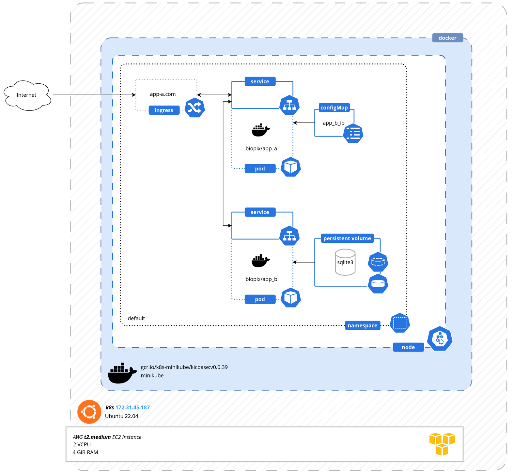

# Homework notebook

# Server setup

To set up the server, I followed the steps outlined below:

1. Create a **t2.medium** AWS instance with ubuntu server. This is essential to ensure that our server provides the appropriate resources - for later use of minikube - like **CPU** and **RAM**.

2. Once the instance is created, it's important to update the system using the command `sudo apt update`.

3. Install `python3-venv` module. This module will allow us to create a virtual environment for our app, which is important to ensure that all the dependencies are installed correctly. To install this module we run the `sudo apt install python3-venv`.

4. Setup a `venv` for manually testing the app by running `python -m venv env` inside the project's directory.

5. After creating the virtual environment, we need to install sqlite3 to prepare the database. This can be done by running the command `sudo apt install sqlite3`.

# Manual app testing

1. Once the installation is complete, we import the given schema using the command `sqlite3 database.db < schema.sql`.

2. Execute the two apps in two different python processes and test them as the initial Github repo suggests.

```
# Test a non-auth'd route
curl http://127.0.0.1:5000/hello

curl -X POST -H 'Authorization: mytoken' http://127.0.0.1:5000/jobs
```


⚠️ **CAUTION** :

While testing the app I had to fix a simple issue for the string comparison at `app_a.py` line **16**. The way app was given tried to compare a string with a `Bytes` object and that made the app to always return a `fail`. The fix of this can be shown in the corresponding [**<mark>commit</mark>**](https://github.com/nikolaof/devops-homework/commit/199e81188c136bf8a111381cc45e724991d5147b)


# Docker

## Install docker engine

### Set up the repository

1. Update the `apt` package index and install packages to allow `apt` to use a repository over HTTPS:

```shell
sudo apt-get update

sudo apt-get install ca-certificates curl gnupg
```

2. Add Docker's official GPG key:

```shell
sudo install -m 0755 -d /etc/apt/keyrings

curl -fsSL https://download.docker.com/linux/ubuntu/gpg | sudo gpg --dearmor -o /etc/apt/keyrings/docker.gpg

sudo chmod a+r /etc/apt/keyrings/docker.gpg
```

3. Use the following command to set up the repository:

```shell
echo \ "deb [arch="$(dpkg --print-architecture)" signed-by=/etc/apt/keyrings/docker.gpg] https://download.docker.com/linux/ubuntu \ "$(. /etc/os-release && echo "$VERSION_CODENAME")" stable" | \ sudo tee /etc/apt/sources.list.d/docker.list > /dev/null
```

### Install Docker Engine

1. Update the `apt` package index:

```shell
sudo apt-get update
```

2. Install **Docker Engine** and **containerd**.

```shell
sudo apt-get install docker-ce docker-ce-cli containerd.io docker-buildx-plugin
```

### Install Docker compose

1. Download and install **Compose standalone**.

```shell
sudo curl -SL https://github.com/docker/compose/releases/download/v2.17.2/docker-compose-linux-x86_64 -o /usr/local/bin/docker-compose
```

2. Apply executable permissions to the standalone binary in the target path for the installation.

```shell
sudo chmod +x /usr/local/bin/docker-compose
```

## Dockerizing the apps

### Create a custom network

First, we create a custom Docker network for our containers to connect to. This provides isolation from other containers and allows us to assign static IPs to our containers, making communication between them easier.

```shell
sudo docker network create -d bridge --subnet 10.0.0.0/16 --gateway 10.0.0.1 kebormed_net
```

### App's A Dockerfile

The following Dockerfile is used for the **app A**

```Dockerfile
FROM python:3.10-alpine

LABEL author="Nikolaos Fikas"
LABEL description="Kebormed homework challenge."
EXPOSE 5000

WORKDIR /app

COPY app_a.py ./
COPY requirements.txt ./

RUN pip install --no-cache-dir -r requirements.txt

CMD [ "python", "./app_a.py" ]
```

* Build the image

```shell
sudo docker build --tag app_a .
```

* Start **app_a** container

```shell
sudo docker run -d -e APP_B_IP=<IP> -p 80:5000 -name app_a app_a
```

### App's B Dockerfile

For this case, I have created a simple bash script `entrypoint.sh` that checks if the `database.db` file exists. If it does not exist, we need to import the initial database because it means that the setup is freshly created.

**Dockerfile**

```Dockerfile
FROM python:3.10-alpine

LABEL author="Nikolaos Fikas"
LABEL description="Kebormed homework challenge."
EXPOSE 5001

WORKDIR /app

COPY app_b.py ./
COPY requirements.txt ./
COPY entrypoint.sh ./
COPY schema.sql ./

RUN mkdir sqlite

RUN chmod +x entrypoint.sh

RUN apk update && apk upgrade

RUN apk add --no-cache sqlite

RUN pip install --no-cache-dir -r requirements.txt

CMD [ "./entrypoint.sh" ]
```

**entrypoint.sh**

```shell
#!/bin/sh

if [ -f "./sqlite/database.db" ]
then
        echo "[INFO] Database file found. Running script."
        python app_b.py
else
        echo "[INFO] Database file does not exist. Creating a new one from schema.sql"
        sqlite3 ./sqlite/database.db < schema.sql
        python app_b.py
fi
```

* Build the image

```shell
sudo docker build --tag app_b .
```

* Start **app_b** container

```shell
sudo docker run -d -v /opt/docker-volumes/app_b:/app/sqlite -p 5001:5001 -name app_b app_b
```

After opening the port 80 in the firewall (from the AWS Console) and testing that everything worked properly I continued with constructing a `docker-compose.yml` file describing the whole infrastructure.

## Docker-compose

The `docker-compose.yml` file looks like:

```yaml
version: "3.7"
services:
    app_a:
        container_name: app_a
        image: app_a
        environment:
          - APP_B_IP=10.0.0.3
        ports:
          - "80:5000"
        networks:
            kebormed_net:
                ipv4_address: 10.0.0.2

    app_b:
        container_name: app_b
        image: app_b
        volumes:
            - '/opt/docker-volumes/app_b:/app/sqlite'
        networks:
            kebormed_net:
                ipv4_address: 10.0.0.3

networks:
    kebormed_net:
      external: true
```

## Publish images on Docker hub's registry

After checking that everything's working properly I published the images in docker hub.

```shell
docker login
docker tag app_a:latest biopix/app_a:latest
docker tag app_b:latest biopix/app_b:latest
docker push biopix/app_a:latest
docker push biopix/app_b:latest
```

# Kubernetes setup

## kubectl installation

1. Update the `apt` package index.

```shell
sudo apt-get update
```

2. Download the Google Cloud public signing key:

```shell
sudo curl -fsSLo /etc/apt/keyrings/kubernetes-archive-keyring.gpg https://packages.cloud.google.com/apt/doc/apt-key.gpg
```

3. Add the Kubernetes `apt` repository:

```shell
echo "deb [signed-by=/etc/apt/keyrings/kubernetes-archive-keyring.gpg] https://apt.kubernetes.io/ kubernetes-xenial main" | sudo tee /etc/apt/sources.list.d/kubernetes.list
```

4. Update `apt` package index with the new repository and install kubectl:

```shell
sudo apt-get update
sudo apt-get install -y kubectl
```

## Minikube installation

```shell
curl -LO https://storage.googleapis.com/minikube/releases/latest/minikube-linux-amd64
sudo install minikube-linux-amd64 /usr/local/bin/minikube
```

# App deployment

## Architecture



## App's A Deployment

### Ingress variant

The following deployment and service configuration were applied for deploying **app-a**

```yaml
apiVersion: apps/v1
kind: Deployment
metadata:
  name: app-a-deployment
  labels:
    app: app-a
spec:
  replicas: 1
  selector:
    matchLabels:
      app: app-a
  template:
    metadata:
      labels:
        app: app-a
    spec:
      containers:
      - name: app-a
        image: biopix/app_a
        ports:
        - containerPort: 5000
        env:
        - name: APP_B_IP
          valueFrom:
            configMapKeyRef:
              name: app-b-configmap
              key: app_b_ip

---

apiVersion: v1
kind: Service
metadata:
  name: app-a-service
spec:
  selector:
    app: app-a
  ports:
    - protocol: TCP
      port: 5000
      targetPort: 5000
```

### External service variant

Prior to using the Ingress component of Kubernetes, I had set the app's service to an external one in order to access the app from outside. The corresponding configuration had some differences in that case, which are shown below.

```yaml
apiVersion: v1
kind: Service
metadata:
  name: app-a-service
spec:
  selector:
    app: app-a
  type: LoadBalancer
  ports:
    - protocol: TCP
      port: 5000
      targetPort: 5000
      nodePort: 30001
```

Since I ran the entire setup using Minikube, I had to manually assign an external IP to the service by running the following command:

```shell
minikube service app-a-service
```

Finally the solution of the Ingress was selected since it allows us to use port numbers smaller than 30000, assign a domain name and also looks more professional.

## App's B Deployment

The following deployment and service configuration were applied for deploying **app-b**

```yaml
apiVersion: apps/v1
kind: Deployment
metadata:
  name: app-b-deployment
  labels:
    app: app-b
spec:
  replicas: 1
  selector:
    matchLabels:
      app: app-b
  template:
    metadata:
      labels:
        app: app-b
    spec:
      containers:
      - name: app-b
        image: biopix/app_b
        ports:
        - containerPort: 5001
        volumeMounts:
        - name: sqlite-persistent-storage
          mountPath: /app/sqlite
      volumes:
      - name: sqlite-persistent-storage
        persistentVolumeClaim:
          claimName: sqlite-pv-claim
---

apiVersion: v1
kind: Service
metadata:
  name: app-b-service
spec:
  selector:
    app: app-b
  ports:
    - protocol: TCP
      port: 5001
      targetPort: 5001
```

## ConfigMap

Following is the _**ConfigMap**_ that **App A** is using to get **App's B** IP address.

```yaml
apiVersion: v1
kind: ConfigMap
metadata:
  name: app-b-configmap
data:
  app_b_ip: app-b-service
```

## Persistent volume & volume claim

Following are the _**pv**_ and the _**pvc**_ for setting a local persistent volume for the **app-b**

```yaml
apiVersion: v1
kind: PersistentVolume
metadata:
  name: sqlite-pv-volume
  labels:
    type: local
spec:
  storageClassName: manual
  capacity:
    storage: 2M
  accessModes:
    - ReadWriteOnce
  hostPath:
    path: "/opt/docker-volumes/app_b"
---
apiVersion: v1
kind: PersistentVolumeClaim
metadata:
  name: sqlite-pv-claim
spec:
  storageClassName: manual
  accessModes:
    - ReadWriteOnce
  resources:
    requests:
      storage: 2M
```

## Ingress

Following is the _**Ingress**_ configuration for forwarding the outside requests to the **app-a**

```yaml
apiVersion: networking.k8s.io/v1
kind: Ingress
metadata:
  name: app-a-ingress
  namespace: default
  annotations:
    nginx.ingress.kubernetes.io/rewrite-target: /
spec:
  ingressClassName: nginx
  rules:
  - host: app-a.com
  - http:
      paths:
      - path: /
        pathType: Prefix
        backend:
          service:
            name: app-a-service
            port:
              number: 5000
```

## Setup instructions

In order to use Ingress, we need to enable the Ingress controller -that evaluates the ingress rules above- in the Minikube by running :

```shell
 minikube addons enable ingress
```

Then the `yaml` files should be applied in the following order using the `kubectl` command.

```shell
kubectl apply -f sqlite-pv.yaml
kubectl apply -f configmap.yaml
kubectl apply -f app_b-deployment.yaml
kubectl apply -f app_a-deployment.yaml
kubectl apply -f app_a-ingress.yaml
```

We can finally check whether an IP address has been assigned to the Ingress component by running:

```shell
kubectl get ingress -n default
NAME            CLASS   HOSTS       ADDRESS        PORTS   AGE
app-a-ingress   nginx   app-a.com   192.168.49.2   80      75s
```

### Testing the app

If we run from the AWS's instance SSH connection the following command

```shell
curl -X POST -H 'Authorization: mytoken' http://192.168.49.2/jobs
```

we get back the proper response

```
Jobs:
Title: Devops
Description: Awesome
```
